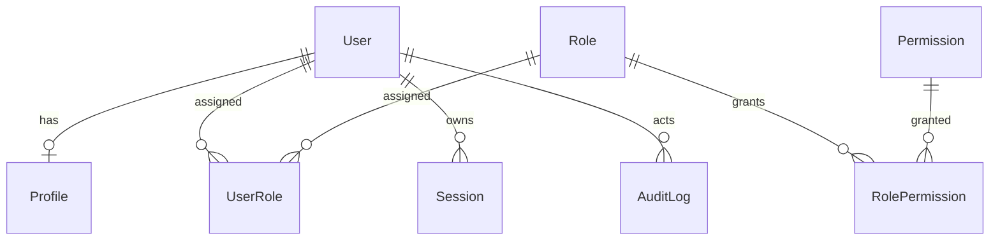

# Identity ERD

This document describes the Prompt 3 identity database schema.

## Tables

### User

System identity record.

- `id`: primary key.
- `email`: unique email address.
- `username`: unique username.
- `status`: `UserStatus`.
- `emailVerified`: email verification flag.
- `createdAt`, `updatedAt`: lifecycle timestamps.

### Profile

Optional user profile metadata.

- `id`: primary key.
- `userId`: unique foreign key to `User`.
- `firstName`, `lastName`, `avatarUrl`: optional profile fields.
- `timezone`: defaults to `UTC`.
- `locale`: defaults to `en-US`.
- `createdAt`, `updatedAt`: lifecycle timestamps.

### Role

RBAC role definition.

- `id`: primary key.
- `name`: unique role name.
- `description`: optional description.
- `createdAt`, `updatedAt`: lifecycle timestamps.

### Permission

Granular permission definition.

- `id`: primary key.
- `name`: unique permission name.
- `description`: optional description.
- `createdAt`, `updatedAt`: lifecycle timestamps.

### UserRole

User-to-role assignment join table.

- `userId`: foreign key to `User`.
- `roleId`: foreign key to `Role`.
- `assignedAt`: assignment timestamp.
- Composite primary key: `userId`, `roleId`.

### RolePermission

Role-to-permission assignment join table.

- `roleId`: foreign key to `Role`.
- `permissionId`: foreign key to `Permission`.
- `assignedAt`: assignment timestamp.
- Composite primary key: `roleId`, `permissionId`.

### Session

Future session persistence foundation.

- `id`: primary key.
- `userId`: foreign key to `User`.
- `expiresAt`: session expiry timestamp.
- `createdAt`: lifecycle timestamp.

### AuditLog

Security and compliance event record.

- `id`: primary key.
- `actorUserId`: nullable foreign key to `User`.
- `action`: event action.
- `entityType`: affected entity type.
- `entityId`: affected entity identifier.
- `metadata`: JSON metadata.
- `createdAt`: event timestamp.

## Relationships

## Cardinality

- One user may have zero or one profile.
- One user may have many role assignments.
- One role may be assigned to many users.
- One role may grant many permissions.
- One permission may be granted by many roles.
- One user may own many sessions.
- One user may be the actor for many audit log entries.
- Audit log actor references are nullable to preserve history after user
  deletion.
